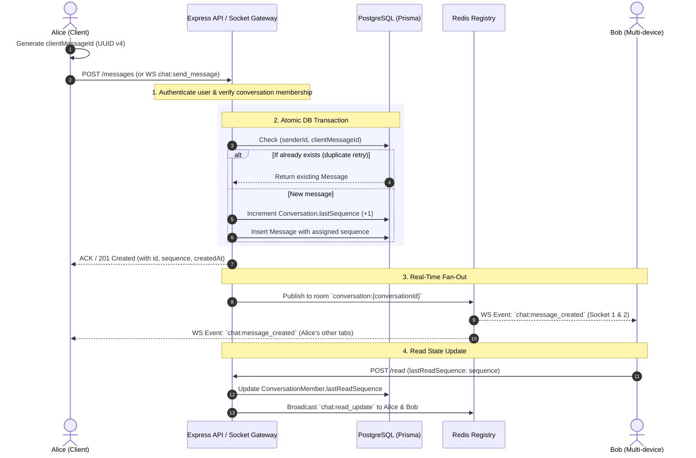

# Hermes Chat Layer Implementation Plan

**Project:** Hermes-teamCollab (`apps/api` & `apps/web`)  
**Status:** Approved Architectural Blueprint  
**Primary Directive:** Build the unified DM and Group Chat text engine first, deploy and validate with real users, then layer Media Attachments (Milestone 2) and Notifications / Push (Milestone 3).

> **Quick Links for This Week:**
> - 👤 **DM Lead Headstart Guide:** [docs/chat/dm.md](./dm.md)
> - 👥 **Group Chat Lead Headstart Guide:** [docs/chat/groupchat.md](./groupchat.md)

---


## 1. Executive Summary & Core Philosophy

The Hermes Chat Layer provides real-time communication across workspaces. The overarching architectural principle is **one unified messaging engine for all conversation types**.

```
                           HERMES CHAT ARCHITECTURE
                                      │
            ┌─────────────────────────┴─────────────────────────┐
            │                                                   │
   SHARED CHAT CORE                                     SHARED MEDIA & NOTIFICATIONS
 (DMs & Group Conversations)                             (Phased Additions)
            │                                                   │
  ┌─────────┼──────────────┐                         ┌──────────┴──────────┐
  │         │              │                         │                     │
Unified  Unified       Realtime                   Direct-to-S3        Notification
Conversation Message  Socket.IO Gateway            Media Upload       Queue & Push
  Model    Model     + Redis Presence              (Milestone 2)      (Milestone 3)
```

### Key Architectural Tenets

1. **Unified Abstraction (No Model Duplication):**
   - Direct Messages (1:1) and Group Chats (1:N) share the same `Conversation`, `ConversationMember`, and `Message` models.
   - DMs are simply conversations of type `DIRECT` with exactly 2 members and a deterministic unique key to prevent duplicate DMs.
   - Groups are conversations of type `GROUP` with 1:N members and role-based permissions (`OWNER`, `ADMIN`, `MEMBER`).
2. **Persist-First, Broadcast-Second:**
   - WebSockets are transient transport pipes, not durable message storage.
   - Every message is validated and persisted in PostgreSQL, assigned a monotonic sequence number within its conversation, and committed **before** broadcasting over Socket.IO.
3. **Deterministic Ordering via Server Sequences:**
   - Instead of relying on client clocks or fragile microsecond timestamps, every conversation maintains an incrementing integer `sequence`.
   - Messages are ordered by `(conversationId, sequence ASC)`. This eliminates message swapping and enables effortless gap detection.
4. **At-Least-Once Delivery with Zero Duplicates (Idempotency):**
   - The sender generates a client UUID (`clientMessageId`).
   - The database enforces a unique constraint on `(senderId, clientMessageId)`. Retries due to network drops safely return the already persisted record without duplicate insertion.
5. **Reconnection Recovery via Cursor Sync:**
   - Sockets query `GET /conversations/:id/messages?afterSequence=<lastKnownSeq>` upon reconnecting to retrieve exactly what was missed during an outage.
6. **Multi-Device / Multi-Tab Synchronization:**
   - Each authenticated user joins a personal room `user:<userId>`. Any message sent or read by the user is broadcast across all their active tabs and devices.

---

## 2. Phased Roadmap: Scope & Prioritization

To ensure fast iteration, stability, and immediate user feedback, execution is divided into three consecutive milestones:

```
┌────────────────────────────────────────────────────────────────────────────────────────┐
│ MILESTONE 1: SHARED CORE TEXT CHAT (DMs + GROUPS)                                      │
│ - Unified Schema & Prisma Migration                                                    │
│ - Conversation & DM Management (Deterministic 1:1 Keys)                                │
│ - Group Chat Lifecycle & Membership Management                                         │
│ - Idempotent Message Persistence & Sequence Ordering                                  │
│ - Real-time Socket.IO Gateway + Redis Room Delivery                                   │
│ - Multi-device Synchronization & Cursor-based Gap Recovery                             │
│ - Read Receipts & Real-time Unread Counters                                            │
│ ► GATEWAY: Test with real users in Staging/Dev before proceeding to attachments!       │
└───────────────────────────────────────────┬────────────────────────────────────────────┘
                                            │
                                            ▼
┌────────────────────────────────────────────────────────────────────────────────────────┐
│ MILESTONE 2: MEDIA & FILE ATTACHMENT INFRASTRUCTURE                                    │
│ - Direct-to-Object-Storage Upload (S3/Cloudflare R2/MinIO Presigned URLs)              │
│ - Pre-upload Validation & Finalization Pipeline                                        │
│ - Attachment Metadata & Message Linking                                                │
│ - Secure Download & Conversation Authorization Gates                                   │
│ - Image Previews & Document Cards in Chat UI                                           │
└───────────────────────────────────────────┬────────────────────────────────────────────┘
                                            │
                                            ▼
┌────────────────────────────────────────────────────────────────────────────────────────┐
│ MILESTONE 3: NOTIFICATIONS, MENTIONS & PUSH                                            │
│ - In-app Notifications Feed & Preferences                                              │
│ - @mention Parsing & User Tagging Pipeline                                             │
│ - Event-driven Background Worker (Decoupled from message write path)                   │
│ - Web Push / Mobile Push Notifications for Offline Users                               │
└────────────────────────────────────────────────────────────────────────────────────────┘
```

---

## 3. Database Design & Prisma Schema Evolution

### Schema Migration Strategy

Currently, `apps/api/prisma/schema.prisma` contains starter models: `Channel`, `Message`, `Conversation`, and `DirectMessage`.  
We will refactor these into a normalized, unified chat architecture:

1. **Deprecate separate `DirectMessage`**: Consolidate all messages into `Message`.
2. **Deprecate separate `Channel`**: Group conversations become `Conversation` with `type = GROUP`.
3. **Introduce `ConversationMember`**: Bridges users to conversations, tracking member roles and individual read progress (`lastReadSequence`).

### Complete Proposed Prisma Schema

```prisma
// ==========================================
// CHAT LAYER MODELS
// ==========================================

enum ConversationType {
  DIRECT
  GROUP
}

enum MessageType {
  TEXT
  SYSTEM
  MEDIA
}

enum ConversationMemberRole {
  OWNER
  ADMIN
  MEMBER
}

model Conversation {
  id              String            @id @default(uuid())
  workspaceId     String
  type            ConversationType  @default(DIRECT)
  
  // For GROUP conversations (optional for DIRECT)
  title           String?
  description     String?
  iconUrl         String?

  // Deterministic unique key for DIRECT conversations:
  // Format: "${workspaceId}:${smallerUserId}:${greaterUserId}"
  // Null for GROUP chats. Guaranteed 1:1 uniqueness at database level.
  canonicalDmKey  String?           @unique

  createdById     String
  createdAt       DateTime          @default(now())
  updatedAt       DateTime          @updatedAt

  // Current maximum message sequence in this conversation
  lastSequence    Int               @default(0)

  // Relations
  workspace       Workspace         @relation(fields: [workspaceId], references: [id], onDelete: Cascade)
  members         ConversationMember[]
  messages        Message[]

  @@index([workspaceId])
  @@index([workspaceId, type])
  @@index([updatedAt(sort: Desc)])
}

model ConversationMember {
  id                String                 @id @default(uuid())
  conversationId    String
  userId            String
  role              ConversationMemberRole @default(MEMBER)
  
  // Track read cursor for unread badge calculation
  lastReadSequence  Int                    @default(0)

  joinedAt          DateTime               @default(now())
  leftAt            DateTime?

  // Relations
  conversation      Conversation           @relation(fields: [conversationId], references: [id], onDelete: Cascade)
  user              User                   @relation(fields: [userId], references: [id], onDelete: Cascade)

  @@unique([conversationId, userId])
  @@index([userId])
  @@index([conversationId])
  @@index([userId, conversationId, lastReadSequence])
}

model Message {
  id                String             @id @default(uuid())
  conversationId    String
  senderId          String
  clientMessageId   String             // Client-generated UUID for retry deduplication
  
  // Monotonic incrementing sequence assigned by server per conversation
  sequence          Int
  
  content           String             @db.Text
  type              MessageType        @default(TEXT)

  isEdited          Boolean            @default(false)
  deletedAt         DateTime?

  createdAt         DateTime           @default(now())
  updatedAt         DateTime           @updatedAt

  // Relations
  conversation      Conversation       @relation(fields: [conversationId], references: [id], onDelete: Cascade)
  sender            User               @relation(fields: [senderId], references: [id], onDelete: Cascade)
  attachments       MessageAttachment[]

  // Integrity Constraints
  @@unique([conversationId, sequence])
  @@unique([senderId, clientMessageId])
  @@index([conversationId, sequence(sort: Desc)])
  @@index([conversationId, createdAt(sort: Desc)])
  @@index([senderId])
}

model MessageAttachment {
  id          String    @id @default(uuid())
  messageId   String
  storageKey  String    // S3 Object Key
  fileName    String
  fileUrl     String    // Presigned or CDN URL
  mimeType    String
  sizeBytes   Int
  metadata    Json?     // Image dimensions { width, height }, etc.
  createdAt   DateTime  @default(now())

  message     Message   @relation(fields: [messageId], references: [id], onDelete: Cascade)

  @@index([messageId])
}
```

### Key Database Integrity Constraints

| Constraint | Target | Purpose |
| :--- | :--- | :--- |
| **Unique `canonicalDmKey`** | `Conversation(canonicalDmKey)` | Prevents duplicate DM threads between the same two users in a workspace. |
| **Unique `(conversationId, userId)`** | `ConversationMember` | Ensures a user cannot be added multiple times to the same conversation. |
| **Unique `(conversationId, sequence)`** | `Message` | Strict linear message ordering without sequence collisions. |
| **Unique `(senderId, clientMessageId)`** | `Message` | Idempotent message sending. Retried network calls return existing message without duplicate records. |
| **Index `(conversationId, sequence DESC)`** | `Message` | Enables lightning-fast cursor pagination when opening chats or scrolling history. |

---

## 4. Message Lifecycle & Real-Time Protocol

### 1. Message Send Flow



### 2. WebSocket Room Topology

Integrating with Hermes's existing Socket.IO setup (`apps/api/src/lib/socket.ts` and `socketMiddleware`):

1. **Personal Mailbox Room (`user:<userId>`)**:
   - Every connected socket automatically joins `user:<socket.data.userId>` upon connection.
   - Purpose: Multi-device sync, DM notifications, unread count badge increments, workspace-level alerts.
2. **Active Conversation Room (`conversation:<conversationId>`)**:
   - Sockets join when the user enters a conversation view (`chat:join_conversation`).
   - Sockets leave when exiting (`chat:leave_conversation`).
   - Purpose: Immediate chat updates, typing indicators, live read state updates.

### 3. Socket Event Contracts

#### Client to Server (`emit`)

| Event Name | Payload | Description |
| :--- | :--- | :--- |
| `chat:join` | `{ conversationId: string }` | Joins the conversation room for active viewing. |
| `chat:leave` | `{ conversationId: string }` | Leaves the conversation room. |
| `chat:send` | `{ conversationId: string, clientMessageId: string, content: string }` | Real-time message send (alternative to REST). |
| `chat:typing` | `{ conversationId: string, isTyping: boolean }` | Ephemeral typing state (debounced every 2.5s). |
| `chat:read` | `{ conversationId: string, sequence: number }` | Marks conversation as read up to given sequence. |

#### Server to Client (`on`)

| Event Name | Payload | Description |
| :--- | :--- | :--- |
| `chat:message_created` | `{ message: MessageDto }` | Broadcast to all members when a message is persisted. |
| `chat:message_ack` | `{ clientMessageId: string, messageId: string, sequence: number }` | Direct acknowledgment to sender socket. |
| `chat:typing` | `{ conversationId: string, userId: string, isTyping: boolean }` | Broadcast to conversation room members. |
| `chat:read_update` | `{ conversationId: string, userId: string, lastReadSequence: number }` | Broadcast read cursor movement. |
| `chat:unread_badge` | `{ conversationId: string, unreadCount: number }` | Direct update to user's personal room `user:<userId>`. |

---

## 5. REST API Specifications

All routes require authentication via `authMiddleware` (JWT cookie) and validate inputs using Zod.

### Conversation Endpoints

#### 1. Create or Get Direct Message (DM)
* **Method & Path:** `POST /api/v1/workspaces/:workspaceSlug/chat/conversations/direct`
* **Request Body:**
  ```json
  {
    "recipientUserId": "usr_9988aabb"
  }
  ```
* **Logic:**
  1. Verify both users are active members of `workspaceSlug`.
  2. Compute canonical key: `${workspace.id}:${[currentUserId, recipientUserId].sort().join(":")}`.
  3. Upsert / find conversation matching `canonicalDmKey`.
  4. Ensure both members exist in `ConversationMember`.
* **Response (200 / 201):**
  ```json
  {
    "success": true,
    "data": {
      "id": "conv_12345",
      "type": "DIRECT",
      "workspaceId": "ws_7788",
      "otherMember": {
        "id": "usr_9988aabb",
        "name": "Alex Smith",
        "imageUrl": "https://..."
      },
      "lastMessage": null,
      "unreadCount": 0
    }
  }
  ```

#### 2. Create Group Conversation
* **Method & Path:** `POST /api/v1/workspaces/:workspaceSlug/chat/conversations/group`
* **Request Body:**
  ```json
  {
    "title": "Frontend Engineering",
    "description": "Discussion on UI components and design systems",
    "memberUserIds": ["usr_1122", "usr_3344"]
  }
  ```
* **Logic:**
  1. Validate all IDs are workspace members.
  2. Create `Conversation` with `type: GROUP`.
  3. Create `ConversationMember` records (Creator = `OWNER`, others = `MEMBER`).
* **Response (201 Created):** Full conversation details with members list.

#### 3. List User's Conversations (Inbox)
* **Method & Path:** `GET /api/v1/workspaces/:workspaceSlug/chat/conversations`
* **Query Params:** `type=DIRECT|GROUP` (optional)
* **Response:** Array of conversations including snippet of last message, other member info (for DMs), and dynamic `unreadCount`.

#### 4. Add / Remove Group Members
* **Method & Path:** `POST /api/v1/workspaces/:workspaceSlug/chat/conversations/:conversationId/members`
* **Method & Path:** `DELETE /api/v1/workspaces/:workspaceSlug/chat/conversations/:conversationId/members/:userId`
* **Permissions:** Only `OWNER` or `ADMIN` can add/remove members. Any user can leave (`DELETE /members/me`).

---

### Message & Synchronization Endpoints

#### 1. Send Message
* **Method & Path:** `POST /api/v1/chat/conversations/:conversationId/messages`
* **Request Body:**
  ```json
  {
    "clientMessageId": "d3b07384-d113-464a-bb9a-c9d380e28f32",
    "content": "Hey team, how is the deployment going?"
  }
  ```
* **Response (201 Created):**
  ```json
  {
    "success": true,
    "data": {
      "id": "msg_9988",
      "conversationId": "conv_12345",
      "sequence": 42,
      "clientMessageId": "d3b07384-d113-464a-bb9a-c9d380e28f32",
      "content": "Hey team, how is the deployment going?",
      "senderId": "usr_alice",
      "createdAt": "2026-09-21T15:30:00.000Z"
    }
  }
  ```

#### 2. Get Message History (Cursor Pagination)
* **Method & Path:** `GET /api/v1/chat/conversations/:conversationId/messages`
* **Query Params:**
  - `beforeSequence`: integer (fetch older messages before this sequence)
  - `limit`: integer (default: 50, max: 100)
* **Response:**
  ```json
  {
    "success": true,
    "data": {
      "messages": [...],
      "hasMore": true,
      "oldestSequence": 12,
      "newestSequence": 42
    }
  }
  ```

#### 3. Catch-up / Sync After Reconnection
* **Method & Path:** `GET /api/v1/chat/conversations/:conversationId/sync`
* **Query Params:** `afterSequence`: integer (last sequence the client received before disconnect)
* **Response:** Returns all messages where `sequence > afterSequence` (up to 200).

#### 4. Mark Read Cursor
* **Method & Path:** `POST /api/v1/chat/conversations/:conversationId/read`
* **Request Body:**
  ```json
  {
    "sequence": 42
  }
  ```
* **Logic:**
  Updates `ConversationMember.lastReadSequence = GREATEST(lastReadSequence, sequence)`. Emits `chat:read_update` to conversation room.

---

## 6. Backend Directory Structure (`apps/api`)

To keep the codebase maintainable and prevent duplicate modules, the chat layer is organized as follows:

```
apps/api/src/
├── modules/
│   ├── chat/
│   │   ├── conversation/
│   │   │   ├── conversation.routes.ts        # REST endpoints for DMs and Groups
│   │   │   ├── conversation.controller.ts    # Request handlers & HTTP responses
│   │   │   ├── conversation.service.ts       # DM canonical logic, group permissions
│   │   │   ├── conversation.repository.ts    # Prisma queries for Conversation & Member
│   │   │   └── conversation.schema.ts        # Zod validation schemas
│   │   │
│   │   ├── message/
│   │   │   ├── message.routes.ts             # REST endpoints for messages & history
│   │   │   ├── message.controller.ts         # Message request handlers
│   │   │   ├── message.service.ts            # Idempotency, sequence allocation, persistence
│   │   │   ├── message.repository.ts         # Prisma atomic transactions & queries
│   │   │   └── message.schema.ts             # Zod validation for message payload
│   │   │
│   │   ├── realtime/
│   │   │   ├── chat.gateway.ts               # Socket.IO event listeners & room wiring
│   │   │   ├── chat.events.ts                # Typed event definitions & constants
│   │   │   └── chat.broadcaster.ts           # Redis Pub/Sub / Socket.IO broadcast helpers
│   │   │
│   │   ├── media/                           # [MILESTONE 2]
│   │   │   ├── media.routes.ts
│   │   │   ├── media.service.ts              # S3/R2 presigned upload provider
│   │   │   └── media.schema.ts
│   │   │
│   │   └── notification/                    # [MILESTONE 3]
│   │       ├── notification.service.ts
│   │       ├── notification.worker.ts
│   │       └── notification.routes.ts
│   │
│   └── presence/                             # (Existing Presence Module - Reused)
```

---

## 7. Execution Checklist & Verification Gate

### Milestone 1: Core Text Chat (DM + Group)

- [ ] **Step 1.1: Database Schema & Migration**
  - Update `apps/api/prisma/schema.prisma` with `Conversation`, `ConversationMember`, and `Message`.
  - Add indexes and unique constraints (`canonicalDmKey`, `sequence`, `clientMessageId`).
  - Run `pnpm prisma migrate dev --name init_chat_layer`.

- [ ] **Step 1.2: Conversation Management (DM & Group)**
  - Implement canonical DM generation algorithm (`workspaceId:minUserId:maxUserId`).
  - Implement group conversation creation, member add/remove/leave.
  - Write unit & integration tests for DM uniqueness and group permissions.

- [ ] **Step 1.3: Message Persistence & Monotonic Sequence Engine**
  - Implement atomic transaction in `message.repository.ts` allocating `lastSequence + 1`.
  - Implement deduplication on `(senderId, clientMessageId)`.
  - Implement cursor-based history pagination (`beforeSequence`) and catch-up query (`afterSequence`).

- [ ] **Step 1.4: Real-Time Socket Gateway**
  - Extend `createSocketServer` in `apps/api/src/lib/socket.ts` with chat event handlers.
  - Wire `user:<userId>` and `conversation:<conversationId>` room management.
  - Implement real-time broadcasting on message creation and read updates.

- [ ] **Step 1.5: Read State & Unread Counts**
  - Implement `lastReadSequence` tracking in `ConversationMember`.
  - Compute unread messages: `COUNT(Message) WHERE sequence > lastReadSequence`.
  - Emit real-time unread count updates.

- [ ] **Step 1.6: Web Client UI Integration**
  - Build/mount DM and Group chat window in `apps/web`.
  - Connect `useChat` hook to Socket.IO with optimistic message rendering.
  - Implement auto-reconnection and missed message sync.

- [ ] **CRITICAL VERIFICATION GATE: Real-User Testing**
  - Deploy Milestone 1 to staging / dev environment.
  - Verify with 2+ real users:
    1. Real-time back-and-forth messaging in 1:1 DMs.
    2. Multi-member real-time group conversations.
    3. Multi-tab sync: Alice opens 2 tabs; messages sent from Tab 1 appear immediately in Tab 2.
    4. Offline/Reconnection: Bob turns off WiFi, Alice sends 3 messages, Bob reconnects and observes automatic sync without duplicates.
    5. Read receipts: Unread badges decrement accurately upon opening the thread.
  - **Do NOT proceed to Milestone 2 until Milestone 1 passes this gate!**

---

### Milestone 2: Media & File Upload Infrastructure

- [ ] **Step 2.1: S3 / Cloudflare R2 Provider Setup**
  - Configure S3 client in `apps/api/src/infrastructure/storage`.
  - Implement `POST /api/v1/chat/media/initiate-upload` returning a presigned PUT URL.
  - Enforce file size limits (e.g. 20MB for images, 50MB for files) and MIME type allowlists.

- [ ] **Step 2.2: Attachment Association & Message Linking**
  - Implement `POST /api/v1/chat/media/finalize-upload`.
  - Link `MessageAttachment` to `Message`.
  - Implement conversation access checks before returning secure download URLs.

- [ ] **Step 2.3: Frontend Media Cards & Previews**
  - Implement image lightbox preview and file download cards.
  - Show upload progress bar and retry state.

---

### Milestone 3: Notifications, Mentions & Push

- [ ] **Step 3.1: Mentions Pipeline**
  - Parse `@username` and `@here` from message content.
  - Create mention notification events.

- [ ] **Step 3.2: In-App Notification Center**
  - Build `Notification` table and API endpoints (`GET /notifications`, `PATCH /notifications/:id/read`).
  - Badge counter in the navigation bar.

- [ ] **Step 3.3: Background Worker & Push Delivery**
  - Introduce worker queue for asynchronous notification fan-out.
  - Check Redis online status: if recipient has 0 active sockets, dispatch Web Push / Mobile Push notification.
  - Add user notification preference toggles (Mute thread, DMs only, All messages).

---

## 8. Summary of Technical Decisions

| Concern | Final Architecture Decision | Rationale |
| :--- | :--- | :--- |
| **DM Uniqueness** | `canonicalDmKey` composite unique key | Enforced at database layer; eliminates race conditions creating multiple DM channels between the same two users. |
| **Message Ordering** | Server-assigned monotonic integer sequence | Eliminates clock drift issues across client devices and makes pagination rock-solid. |
| **Deduplication** | Client-provided UUID + Unique DB index | Zero duplicate messages even under unstable cellular networks. |
| **Real-time Delivery** | Socket.IO + Redis Room Adapter | Reuses existing presence infrastructure, horizontally scalable across multiple API nodes. |
| **Milestone Sequence** | Text Core (DM+Group) ➔ Real-User Validation ➔ Media ➔ Notifications | Keeps focus razor-sharp on user experience and chat responsiveness before introducing heavy file storage and push dependencies. |
