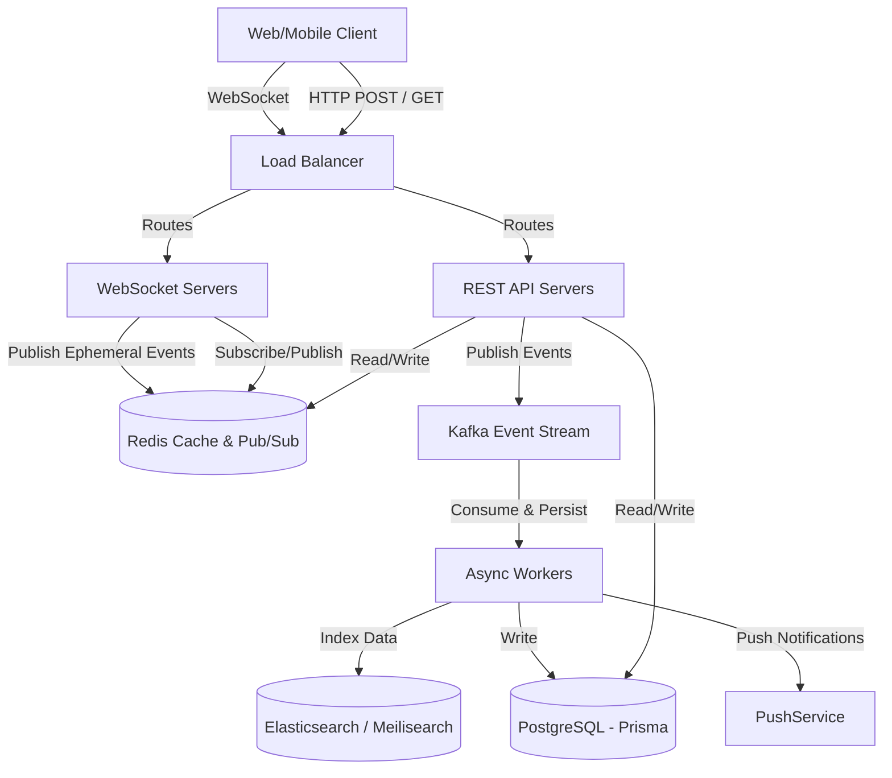

# Chat System Architecture Overview

This document outlines the high-level system design for the Hermes real-time chat infrastructure, designed for high availability, low latency, and horizontal scalability.

## High-Level Architecture

The chat system relies on a combination of persistent storage, in-memory caches, message brokers, and real-time websocket connections.

## Core Components

### 1. WebSocket Servers (Socket.io)
Responsible for maintaining persistent connections with clients. They handle:
- Receiving ephemeral events (typing indicators, online status).
- Broadcasting new messages to connected clients.
- Rooms management (Subscribing users to Channel IDs or Conversation IDs).

### 2. Redis (Pub/Sub & Caching)
- **Pub/Sub (Adapter):** Since WebSocket servers will be horizontally scaled, a message sent to Node A needs to reach a user connected to Node B. Redis Pub/Sub acts as the adapter so all WS nodes share events.
- **Online Presence:** When a user connects, their `userId` is stored in Redis with a short TTL (Time To Live). A heartbeat from the client refreshes this TTL. If it expires, the user is marked offline.
- **Caching:** Recent messages and active user lists in a channel are cached to prevent heavy DB hits on initial load.

### 3. Kafka (Message Queue)
For a highly scalable system, saving messages directly to the database during the HTTP request can become a bottleneck.
- **Topic `chat.messages`:** All new messages are pushed to this Kafka topic.
- **Topic `chat.events`:** Used for non-message events like reactions (emojis), edits, and deletions.
- **Consumers (Workers):** Background services consume these topics to:
  1. Persist the message to PostgreSQL.
  2. Send push notifications.
  3. Index the message for search.

### 4. Ephemeral Events (Typing & Status)
Events like "User is typing..." do not need to be persisted to the database or Kafka.
- **Flow:** Client emits `typing_start(channelId)` to WS server -> WS server publishes to Redis Pub/Sub `channel:events` -> All WS nodes broadcast to clients in that room.

### 5. Reactions (Emojis)
Reactions are persistent but high-volume.
- A user reacts -> HTTP POST to API -> Validated & pushed to Kafka `chat.events` -> Redis Pub/Sub immediately broadcasts to clients for instant UI update -> Kafka consumer asynchronously updates the database row.

## Installation Requirements

To implement this architecture, we will need to install the following dependencies in the `api` and `web` applications:

**Backend (`apps/api`):**
- `socket.io`: The core WebSocket server.
- `@socket.io/redis-adapter` & `ioredis`: To allow multiple WebSocket servers to share events via Redis Pub/Sub.
- `kafkajs`: For publishing and consuming events from Kafka.

**Frontend (`apps/web`):**
- `socket.io-client`: To connect and listen to WebSocket events from the browser.
