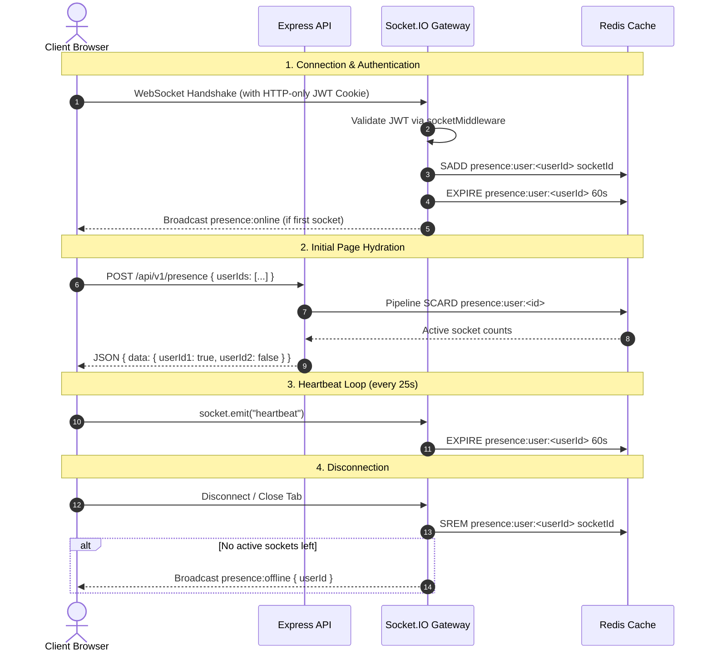

# Real-Time Online Presence System

## 1. Overview & Architecture

Hermes implements a scalable, resilient **Hybrid Presence Architecture**:
1. **HTTP REST Endpoint (`POST /api/v1/presence`)**: Fetches the initial presence snapshot on-demand for requested user IDs in a single $O(1)$ batch lookup via Redis pipelines.
2. **WebSocket Gateway (Socket.IO)**: Streams real-time delta events (`presence:online`, `presence:offline`) across connected clients.
3. **Redis Key-Value Storage**: Uses Redis Sets with time-to-live (TTL) keys (`presence:user:<userId>`) to track multiple active sockets per user (e.g. across multiple browser tabs or devices).
4. **Client-Side Heartbeat Loop**: The frontend emits periodic `heartbeat` pings every 25 seconds to refresh the 60-second Redis TTL while the tab is active.



---

## 2. Backend Implementation (`apps/api`)

### Directory Structure
```text
apps/api/src/
├── lib/
│   ├── redis.client.ts              # Redis client connection
│   └── socket.ts                    # Socket.IO bootstrap and middleware attachment
├── middleware/
│   └── socket.middleware.ts         # Handshake cookie parser and JWT verification
└── modules/
    └── presence/
        ├── presence.types.ts        # Event names, Redis keys, constants
        ├── presence.schema.ts       # Zod request validation
        ├── presence.repository.ts   # Redis operations (SADD, SREM, EXPIRE, pipeline SCARD)
        ├── presence.service.ts      # Multi-socket tracking & event broadcasting
        ├── presence.gateway.ts      # Socket connection/heartbeat event handlers
        ├── presence.controller.ts   # REST endpoint handlers
        └── presence.routes.ts       # Router mounted at /api/v1/presence
```

### Key Components

1. **`presence.repository.ts`**:
   - `addConnection(userId, socketId)`: Adds socket ID to `presence:user:<userId>` set and sets 60s TTL.
   - `removeConnection(userId, socketId)`: Removes socket ID from the set.
   - `refresh(userId)`: Extends the Redis set key TTL to 60s.
   - `isOnline(userId)`: Returns `true` if `SCARD` > 0.
   - `getOnlineStatus(userIds[])`: Executes a Redis `pipeline()` with `SCARD` for all IDs in a single round-trip, returning `Record<string, boolean>`.

2. **`presence.service.ts`**:
   - Emits `presence:online` only when a user transitions from 0 to 1 socket connections.
   - Emits `presence:offline` only when a user drops to 0 active socket connections.

3. **`presence.routes.ts` & `presence.controller.ts`**:
   - Route: `POST /api/v1/presence`
   - Validates `userIds` array (1–500 IDs) via Zod.
   - Returns `{ success: true, data: { [userId]: boolean }, error: null }`.

---

## 3. Frontend Implementation (`apps/web`)

### Directory Structure
```text
apps/web/
├── lib/
│   └── socket.ts                    # Socket.IO client instance (withCredentials: true)
├── providers/
│   └── SocketProvider.tsx           # Context provider + 25s heartbeat loop
├── hooks/
│   └── use-presence.ts              # Custom hook (initial fetch + socket event listener)
└── components/
    └── ui/
        └── UserAvatar.tsx           # Reusable avatar with real-time status indicator dot
```

### Key Components

1. **`SocketProvider.tsx`**:
   - Mounts on authenticated workspace layouts.
   - Re-attaches connection if disconnected and runs `setInterval` to emit `socket.emit("heartbeat")` every 25 seconds.

2. **`use-presence.ts`**:
   - Calls `POST /api/v1/presence` on mount and extracts `res.data`.
   - Re-fetches automatically when `socket.on("connect")` fires to eliminate race conditions.
   - Listens to `presence:online` and `presence:offline` socket events to update the reactive `presenceMap` state.
   - Provides an `isOnline(userId)` helper.

3. **`UserAvatar.tsx`**:
   - Reusable avatar supporting sizes `xs`, `sm`, `md`, `lg`, `xl`.
   - Displays custom images with automatic fallback to name-based deterministic gradient colors and initials.
   - Renders a real-time status indicator dot:
     - 🟢 **Online**: `bg-emerald-500 shadow-[0_0_8px_rgba(16,185,129,0.8)]`
     - ⚪ **Offline**: `bg-slate-500`

---

## 4. API & Event Reference

### REST Endpoint

#### Batch Presence Query
* **Method**: `POST`
* **URL**: `/api/v1/presence`
* **Headers**: `Content-Type: application/json`
* **Request Body**:
  ```json
  {
    "userIds": ["usr_abc123", "usr_def456"]
  }
  ```
* **Response (200 OK)**:
  ```json
  {
    "success": true,
    "data": {
      "usr_abc123": true,
      "usr_def456": false
    },
    "error": null
  }
  ```

### WebSocket Events

| Event Name | Direction | Payload | Description |
| :--- | :--- | :--- | :--- |
| `heartbeat` | Client ➔ Server | *None* | Sent every 25s by client to extend Redis 60s TTL. |
| `presence:online` | Server ➔ Client | `{ "userId": "string" }` | Broadcast when a user establishes their first socket connection. |
| `presence:offline` | Server ➔ Client | `{ "userId": "string" }` | Broadcast when a user's last socket disconnects. |

---

## 5. Scalability & Future Enhancements

1. **Workspace-Scoped Broadcasts**:
   - Currently, `io.emit` broadcasts presence changes across the server. For large enterprise deployments, sockets can join `workspace:${workspaceId}` rooms so events are scoped to relevant teammates only.
2. **Multi-Instance Redis Pub/Sub Adapter**:
   - When deploying multiple API instances behind a load balancer, connect `@socket.io/redis-adapter` so `presence:online` events broadcast seamlessly across all Node.js cluster processes.
